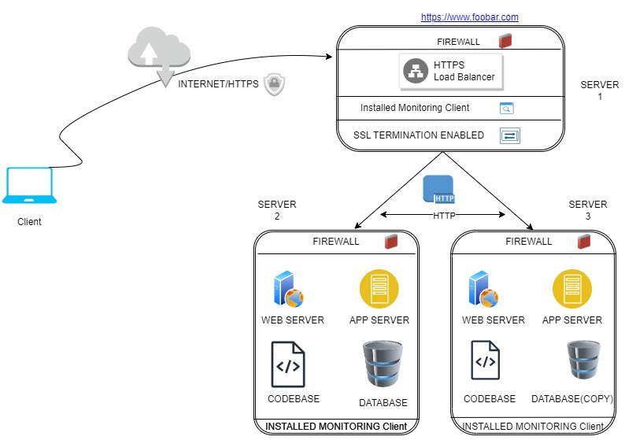

## Specific Details about the Web Infrastructure

    

### Balancing Server:
By utilizing a dedicated load balancer, you distribute incoming requests evenly across multiple backend servers, ensuring high availability and efficient utilization of resources.

### Firewalls:
Firewalls act as security barriers between internal networks and external threats. They filter incoming and outgoing network traffic based on predetermined rules, preventing unauthorized access attempts and malicious activity. For example, you might configure firewall rules to block certain IP addresses known to host malware or restrict access to sensitive databases.

### SSL Certificate:
Serving traffic over HTTPS ensures secure communication between users and your site. An SSL certificate establishes trust and protects against man-in-the-middle attacks.

### Monitoring Clients:
Monitoring tools collect performance metrics and logs to identify potential issues early, allowing proactive maintenance and optimization. Data collected includes CPU usage, memory consumption, disk space, error rates, and more.

### HTTPS Load Balancer:
Terminating SSL connections at the load balancer level offloads encryption processing from backend servers, improving their overall performance.

### Codebase, Database, Web Server & App Server:
Each component serves its purpose:
- Codebase contains the logic behind your website.
- Database stores user data and dynamic content.
- Web Server handles client requests and delivers static assets.
- Application Server executes business logic and interacts with the database.

### Database Configuration:
Having only one MySQL server capable of handling write operations increases the risk of bottlenecks during peak loads. Consider implementing read replicas or sharding strategies to spread workload across multiple instances.

### Homogeneous Servers:
Running identical components on each server reduces flexibility and scalability options. Consider deploying different roles per server to accommodate future growth and specialized requirements.

## Issues With This Infrastructure

### Terminating SSL at the Load Balancer Level:
While this approach improves backend server performance, it introduces a single point of failure since the load balancer becomes responsible for managing certificates.

### Single Write Capable MySQL Server:
As mentioned earlier, this setup creates a potential bottleneck during heavy traffic periods.

### Identical Components Across All Servers:
Homogeneity limits the ability to scale individual components independently, reducing efficiency and flexibility.

## Recommendations:

To address these concerns, consider the following adjustments:
- Implement redundancy measures for the load balancer to prevent downtime due to failures.
- Deploy read replicas or shard the database to handle increased write volumes.
- Distribute components across servers according to their role, enabling independent scaling and improved fault tolerance.

