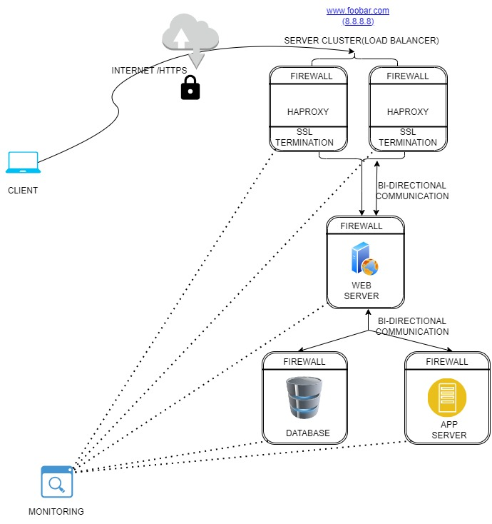

## Enhancing Web Application Scalability and Security through Component Separation

    

When it comes to "splitting components (web server, application server, database) with their own server," the practice involves segregating different parts of a web application onto distinct servers for reasons such as security, performance, and scalability.

### Benefits of Separating Web Servers and Application Servers:

1. **Separation of Concerns**: Dividing presentation logic (web server) from business logic (application server) allows for better organization and maintenance of the code.

2. **Availability**: If one component fails, having them separate can prevent a complete system failure.

3. **Security**: By isolating components, security risks can be minimized, especially in scenarios where one component is compromised.

### Reasons for Separating Database and Web Servers:

1. **Security Concerns**: Having a separate server between the web and database servers can enhance security by preventing direct access to the database if the web server is compromised.

2. **Scalability and Performance**: Separating servers allows for better resource allocation and scalability, improving overall performance.

### Example: E-Commerce Website Architecture

**Web Server**: Handles user requests, serves web pages, and manages user interactions.

**Application Server**: Processes business logic, handles transactions, and manages user sessions.

**Database Server**: Stores product information, user data, and order details.

#### Scalability Scenario:

**Increased Web Traffic**: During a sale event, the website experiences a surge in traffic.

**Scalability Requirement**: To handle the increased load efficiently.

#### Scalability with Separated Components:

- **Web Server Scaling**: Additional instances can be deployed easily to handle increased incoming requests without affecting the application server or database.

- **Application Server Scaling**: The application server can be scaled independently to manage the increased business logic processing requirements.

- **Database Scaling**: The database server can be scaled vertically (more powerful hardware) or horizontally (sharding or replication) to handle increased data storage and retrieval demands.

### Benefits of Separated Scalability:

- **Isolation of Concerns**: Each component can be scaled independently based on its specific requirements without impacting the others.

- **Efficient Resource Allocation**: Resources can be allocated where they are needed most during peak loads, optimizing performance.

- **Improved Performance**: With each component able to scale independently, overall system performance remains stable even under heavy loads.

In this scenario, separating components onto their own servers enables easy scalability by allowing each part of the system to grow independently based on its unique demands, ensuring a smooth and efficient handling of increased traffic or workload.

